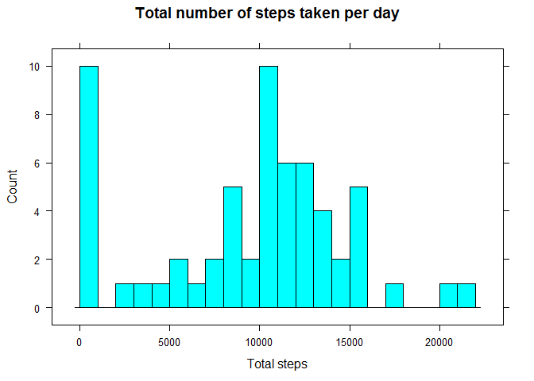
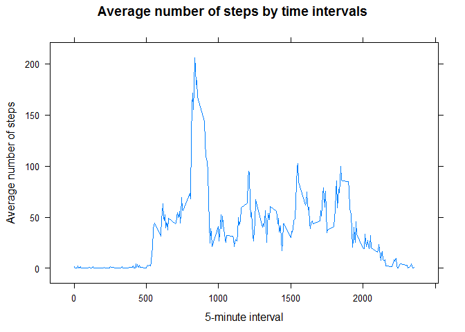
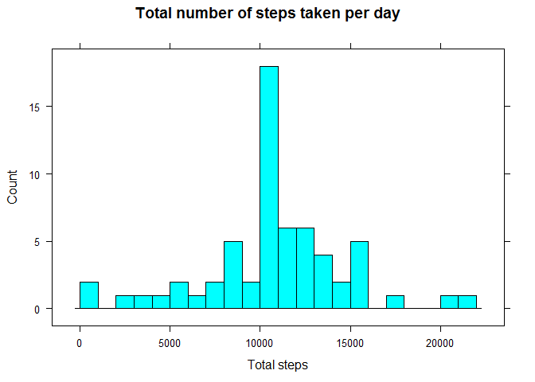
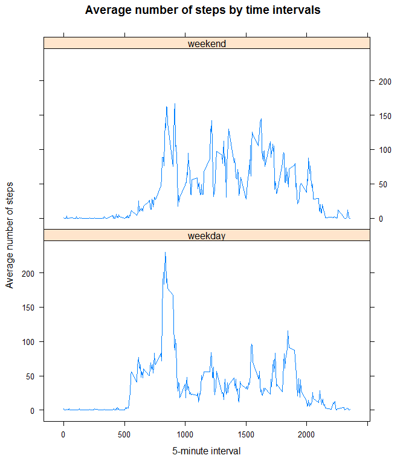

# Reproducible Research: Peer Assessment 1
The project explore the Activity monitoring data, and visulize the distribution 
of total number of steps taken per day, and the average number of steps by time 
interval. By filling the missing data with average number of steps by time 
interval, the project is able to show more clear relationship between the mean
number of steps and the time interval. Finally, the project explores the 
differences in activity patterns between weekdays and weekends by comparing the 
time series plots of the 5-minute interval and the average number of steps taken, 
which are categorized by weekday and weekend.

## Loading and preprocessing the data

Load the activity data stored in the "activity.zip" file, which is included in 
this repo. In order to make this RMarkdown file work, users need to move the 
file to the directory which contains the "activity.zip" file. Print the summary 
table of the activity dataset as the output.


```r
if (("xtable" %in% (installed.packages())) == F) {
        install.packages("xtable")
}
library(xtable)
activity <- read.csv(unz("activity.zip", "activity.csv"), 
                     colClasses = c("integer","Date","integer"))
activityTable <- xtable(summary(activity))
print(activityTable, type = "html")
```

<!-- html table generated in R 3.1.2 by xtable 1.7-4 package -->
<!-- Sat Feb 14 19:18:28 2015 -->
<table border=1>
<tr> <th>  </th> <th>     steps </th> <th>      date </th> <th>    interval </th>  </tr>
  <tr> <td align="right"> 1 </td> <td> Min.   :  0.00   </td> <td> Min.   :2012-10-01   </td> <td> Min.   :   0.0   </td> </tr>
  <tr> <td align="right"> 2 </td> <td> 1st Qu.:  0.00   </td> <td> 1st Qu.:2012-10-16   </td> <td> 1st Qu.: 588.8   </td> </tr>
  <tr> <td align="right"> 3 </td> <td> Median :  0.00   </td> <td> Median :2012-10-31   </td> <td> Median :1177.5   </td> </tr>
  <tr> <td align="right"> 4 </td> <td> Mean   : 37.38   </td> <td> Mean   :2012-10-31   </td> <td> Mean   :1177.5   </td> </tr>
  <tr> <td align="right"> 5 </td> <td> 3rd Qu.: 12.00   </td> <td> 3rd Qu.:2012-11-15   </td> <td> 3rd Qu.:1766.2   </td> </tr>
  <tr> <td align="right"> 6 </td> <td> Max.   :806.00   </td> <td> Max.   :2012-11-30   </td> <td> Max.   :2355.0   </td> </tr>
  <tr> <td align="right"> 7 </td> <td> NA's   :2304   </td> <td>  </td> <td>  </td> </tr>
   </table>

## What is mean total number of steps taken per day?
Calculate total number of steps taken per day, and create the histogram plot of 
the total steps per day using the lattice package.

```r
if (("lattice" %in% (installed.packages())) == F) {
        install.packages("lattice")
}
library(lattice)
stepsperDay <- tapply(activity$steps, activity$date, FUN = sum, na.rm = TRUE)
histogram(stepsperDay, main = "Total number of steps taken per day", 
          xlab = "Total steps", type = "count", breaks = 22)
```

 

Calculate and report the mean and median total number of steps taken per day


```r
mSteps<-data.frame(mean = mean(stepsperDay), median = median(stepsperDay),
                        row.names = "values")
mStepsTable <- xtable(mSteps)
print(mStepsTable, type = "html")
```

<!-- html table generated in R 3.1.2 by xtable 1.7-4 package -->
<!-- Sat Feb 14 19:18:29 2015 -->
<table border=1>
<tr> <th>  </th> <th> mean </th> <th> median </th>  </tr>
  <tr> <td align="right"> values </td> <td align="right"> 9354.23 </td> <td align="right"> 10395 </td> </tr>
   </table>

## What is the average daily activity pattern?

Make a time series plot of the 5-minute interval (x-axis) and the average number
of steps taken, averaged across all days (y-axis)


```r
SI<-tapply(activity$steps, activity$interval, FUN=mean, na.rm = T)
SItable<-data.frame(interval = as.integer(names(SI)), averageSteps = SI)
rownames(SItable) <- NULL
xyplot(averageSteps ~ interval, data = SItable, type = "l",
       main = "Average number of steps by time intervals", 
       xlab = "5-minute interval", ylab = "Average number of steps")
```

 

Identify the 5-minute interval that contains the maximum average number of steps.

```r
maxSI <- SItable[which(SItable$averageSteps == max(SItable$averageSteps)),]
colnames(maxSI)[2] <- "maximum average steps"
maxSItable <- xtable(maxSI)
print(maxSItable, type = "html")
```

<!-- html table generated in R 3.1.2 by xtable 1.7-4 package -->
<!-- Sat Feb 14 19:18:30 2015 -->
<table border=1>
<tr> <th>  </th> <th> interval </th> <th> maximum average steps </th>  </tr>
  <tr> <td align="right"> 104 </td> <td align="right"> 835 </td> <td align="right"> 206.17 </td> </tr>
   </table>

## Imputing missing values

Calculate and report the total number of missing values in the dataset.


```r
missingValues<-data.frame(NumberofMissingValues=sum(!complete.cases(activity)))
MVtable <- xtable(missingValues)
print(MVtable, type = "html")
```

<!-- html table generated in R 3.1.2 by xtable 1.7-4 package -->
<!-- Sat Feb 14 19:18:30 2015 -->
<table border=1>
<tr> <th>  </th> <th> NumberofMissingValues </th>  </tr>
  <tr> <td align="right"> 1 </td> <td align="right"> 2304 </td> </tr>
   </table>

Eliminate the NAs by filling the NAs with the mean number of steps of the 
corresponding 5-minutes interval. Create a new dataset activity_ed with the 
missing data filled in. Then make a histogram of the total number of steps taken
each day and Calculate and report the mean and median total number of steps 
taken per day.


```r
activity_ed<-activity
index<-is.na(activity$steps)
for (i in 1:nrow(activity_ed)){
        if (index[i]) {
                activity_ed$steps[i]<-
                        SItable[which(SItable[,1]==activity_ed$interval[i]),2]
        }
}
stepsperDay_ed<-tapply(activity_ed$steps, activity_ed$date, FUN = sum)
histogram(stepsperDay_ed, main = "Total number of steps taken per day", 
          xlab = "Total steps", type = "count", breaks = 22)
```

 

```r
mSteps_ed<-data.frame(mean = mean(stepsperDay_ed), 
                      median = median(stepsperDay_ed), row.names = "values")
mStepsTable_ed <- xtable(mSteps_ed)
print(mStepsTable_ed, type = "html")
```

<!-- html table generated in R 3.1.2 by xtable 1.7-4 package -->
<!-- Sat Feb 14 19:18:31 2015 -->
<table border=1>
<tr> <th>  </th> <th> mean </th> <th> median </th>  </tr>
  <tr> <td align="right"> values </td> <td align="right"> 10766.19 </td> <td align="right"> 10766.19 </td> </tr>
   </table>

Calculate the impact of imputing missing data on the estimates of the total 
daily number of steps by compare the means and medians of them of the original 
data and the data with missing data filled in.


```r
cmSteps <- rbind(mSteps, mSteps_ed, mSteps_ed - mSteps)
rownames(cmSteps)<-c("Original estimates", "Modified estimates", 
                     "Increased estimates")
cmStepstable <- xtable(cmSteps)
print(cmStepstable, type = "html")
```

<!-- html table generated in R 3.1.2 by xtable 1.7-4 package -->
<!-- Sat Feb 14 19:18:31 2015 -->
<table border=1>
<tr> <th>  </th> <th> mean </th> <th> median </th>  </tr>
  <tr> <td align="right"> Original estimates </td> <td align="right"> 9354.23 </td> <td align="right"> 10395.00 </td> </tr>
  <tr> <td align="right"> Modified estimates </td> <td align="right"> 10766.19 </td> <td align="right"> 10766.19 </td> </tr>
  <tr> <td align="right"> Increased estimates </td> <td align="right"> 1411.96 </td> <td align="right"> 371.19 </td> </tr>
   </table>

## Are there differences in activity patterns between weekdays and weekends?

Use the activity_ed dataset, the one with the filled-in missing values for this 
part of the analysis. Create a new factor variable in the dataset with two 
levels -- "weekday" and "weekend" indicating whether a given date is a weekday 
or weekend day. Make a panel plot containing a time series plot of the 5-minute 
interval (x-axis) and the average number of steps taken, averaged across all 
weekday days or weekend days (y-axis).


```r
Weekday <- weekdays(activity_ed$date, abbreviate = T)
for (i in 1:length(Weekday)){
        if (Weekday[i] %in% c("Mon","Tue","Wed","Thu","Fri")){
                Weekday[i] <- "weekday"
        }
        else {
                Weekday[i] <- "weekend"
        }
}
Weekday <- as.factor(Weekday)
activity_ed <- cbind(activity_ed, Weekday)
acweekday <- activity_ed[activity_ed$Weekday == "weekday",]
acweekend <- activity_ed[activity_ed$Weekday == "weekend",]
SI_ed1<-tapply(acweekday$steps, acweekday$interval, FUN=mean)
SI_ed2<-tapply(acweekend$steps, acweekend$interval, FUN=mean)
SIdf1<-data.frame(interval = as.integer(names(SI_ed1)), averageSteps = SI_ed1)
SIdf2<-data.frame(interval = as.integer(names(SI_ed2)), averageSteps = SI_ed2)
SItable_ed <- rbind(SIdf1,SIdf2)
rownames(SItable_ed) <- NULL
Weekday <- as.factor(rep(c("weekday","weekend"), each = 288))
SItable_ed <- cbind(SItable_ed, Weekday)
xyplot(averageSteps ~ interval|Weekday, data = SItable_ed, type = "l",
       layout = c(1,2), main = "Average number of steps by time intervals", 
       xlab = "5-minute interval", ylab = "Average number of steps")
```

 
